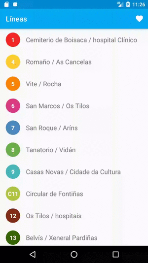
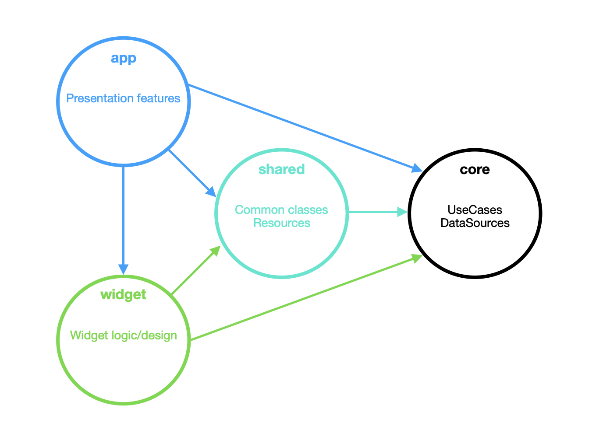

# Bus Santiago

This project contains the code of [Bus Santiago][bus-santiago], a personal app published in Google Play Store which is used to know the arrival times of city buses in real time.

  

## Architecture

This app uses [Android Architecture components][architecture] with [Koin][koin].

<kbd>

</kbd>

The architecture of the app is composed of 4 modules:

### core

Core is the module in charge of **managing access to data** and has no dependencies with other modules.

The **models** and **interfaces** that it exposes to the other modules are located in the `org.galio.bussantiago.core` package, everything else, the implementations of the use cases, the repositories and data sources, is protected with the `internal` modifier.

### shared

This module contains **resources** and **classes** shared by **app** and **widget** modules.
Its function is to avoid repeating certain presentation logic and provide consistency through those modules.

### widget

All **logic and layouts related exclusively to the widget** are in this Android module.

### app

In this module we can find all the presentation features, and it consists mainly of Fragment-ViewModel pairs.

#### ViewModel

The [ViewModel][viewmodel] is the fundamental piece of the [MVVM pattern][mvvm-pattern]. It exposes [LiveData][livedata] objects, which are **lifecycle-aware**, and thanks to this it can protect the state of the information in situations such as changing the orientation of the screen.

On the other hand, the management of asynchrony is done through an instance of [InteractorExecutor][executor], which is responsible for handling the scope of the ViewModels and using **coroutines** to execute the UseCases (whose implementation belongs to **core** module).

#### Fragment

The Fragment acts as a simple **Observer** of the data exposed by the ViewModel.

**Note:** This app follows the **single activity structure** with the [Navigation component][navigation].

[bus-santiago]: https://play.google.com/store/apps/details?id=org.galio.bussantiago&hl=es
[architecture]: https://developer.android.com/topic/libraries/architecture
[koin]: https://insert-koin.io/
[viewmodel]: https://developer.android.com/topic/libraries/architecture/viewmodel
[mvvm-pattern]: https://docs.microsoft.com/en-us/previous-versions/msp-n-p/hh848246(v%3dpandp.10)
[livedata]: https://developer.android.com/topic/libraries/architecture/livedata
[resource]: https://github.com/JoseAngelManeiro/BusSantiago/blob/master/app/src/main/java/org/galio/bussantiago/common/Resource.kt
[executor]: https://github.com/JoseAngelManeiro/BusSantiago/blob/master/app/src/main/java/org/galio/bussantiago/executor/InteractorExecutor.kt
[navigation]: https://developer.android.com/guide/navigation/navigation-getting-started
